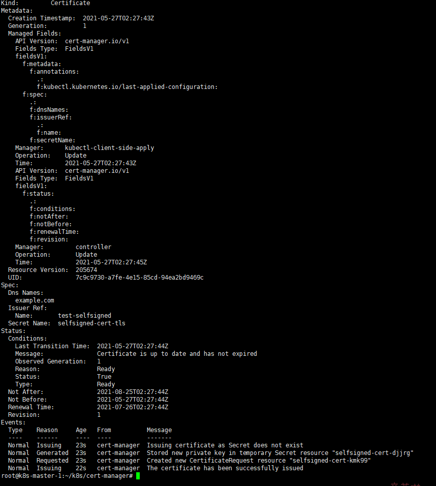

# cert-manager

[cert-manager](https://cert-manager.io/docs/) 是kubernetes原生的证书管理器


## 安装
[helm 安装官方教程](https://cert-manager.io/docs/installation/kubernetes/)
- cert-manager 要求一系列的CRD resources
    - 方式1: 使用kubectl安装CRDs
        ```bash
        kubectl apply -f https://github.com/jetstack/cert-manager/releases/download/v1.3.1/cert-manager.crds.yaml
        ```
    - 方式2(采用): helm安装时使用`--set installCRDs=true`, [参数详情](https://artifacthub.io/packages/helm/cert-manager/cert-manager)
- helm 安装cert-manager
    ```bash
    kubectl create namespace cert-manager
    helm repo add jetstack https://charts.jetstack.io
    helm repo update
    helm install cert-manager jetstack/cert-manager --namespace cert-manager --version v1.3.1 --set installCRDs=true
    ```
    - 查看部署情况
        ```bash
        kubectl get pods --namespace cert-manager
        ```
    - 部署完成后, 测试 webhook 工作是否正常
        - 根据[test-resources.yaml](test-resources.yaml)测试
            ```bash
            kubectl apply -f test-resources.yaml
            # 查看状态
            kubectl describe certificate -n cert-manager-test
            # 可以看到证书
            kubectl describe -n cert-manager-test secret selfsigned-cert-tls
            # 查看证书过期时间
            kubectl get -n cert-manager-test secrets selfsigned-cert-tls -o jsonpath="{.data.ca\.crt}" | base64 -d | openssl x509 -enddate -noout
            ```
            
        - 清除
            ```bash
            kubectl delete -f test-resources.yaml
            ```
## 使用
这里使用ca作为cert-manager的根证书
- 使用openssl命令生成CA证书
    ```bash
    openssl req -newkey rsa:2048 -nodes -keyout tls.key -x509 -days 365 -out tls.crt
    ```
    
- 创建secret: `ca-key-pair`及命名空间: `cert-manager-use`
    - 方式1: 使用[cert-manager-secret.yaml](cert-manager-secret.yaml), 将`tls.crt`、`tls.key`内的内容分别
        ```bash
        kubectl apply -f cert-manager-secret.yaml
        ```
    - 方式2: 命令行
        ```bash
        kubectl create namespace cert-manager-use
        kubectl create secret generic ca-key-pair --from-file=tls.crt --from-file=tls.key -n cert-manager-use
        ```
- 创建完成后查看
    ```bash
    kubectl describe secret ca-key-pair -n cert-manager-use
    # 查看证书过期时间(# TODO fix problem)
    kubectl get -n cert-manager-use secrets ca-key-pair -o jsonpath="{.data.ca\.crt}" | base64 -d | openssl x509 -enddate -noout
    ```
- 参考[test-resources.yaml](test-resources.yaml) 即可创建自定义证书

## 其他知识
详细了解(不采用): 在颁发证书前, 你必须在集群中配置至少一个`Issuer` 或者`ClusterIssuer`(可跨命名空间使用) resource
- 创建`Issuer`, [参考](https://cert-manager.io/docs/concepts/issuer/)

[设置向导](https://cert-manager.io/docs/configuration/) 会教你如何配置颁发证书
- [cert-manager使用ca](https://cert-manager.io/docs/configuration/ca/)

### kubectl 插件
[cert-manager插件](https://cert-manager.io/docs/usage/kubectl-plugin/): 可以使用该插件在
kubernetes集群中管理 cert-manager资源

## 参考
- [k8s中使用cert-manager玩转证书](https://cloud.tencent.com/developer/article/1402451)