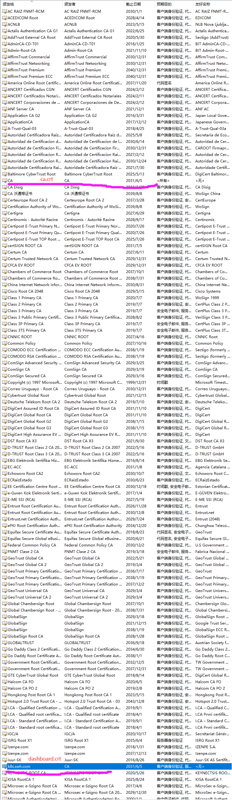
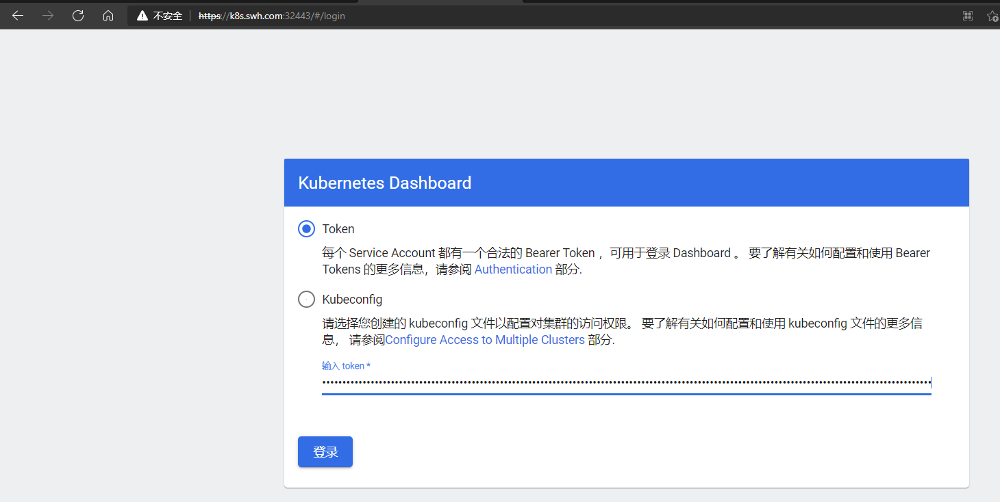
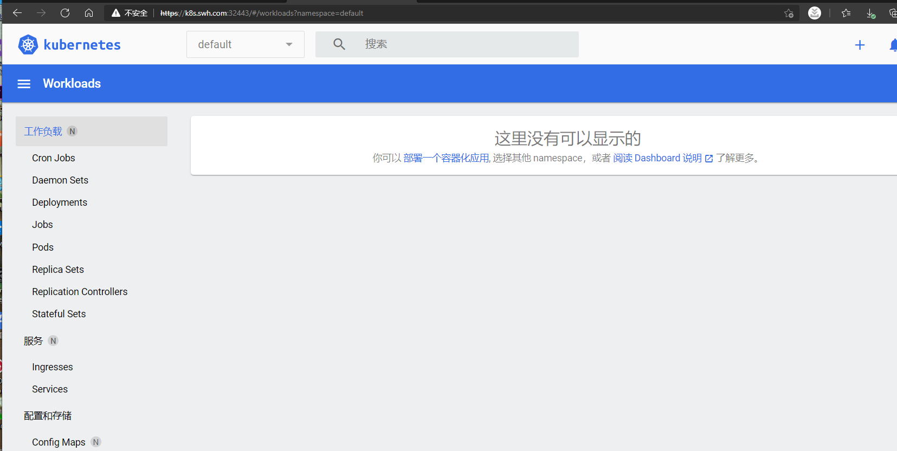
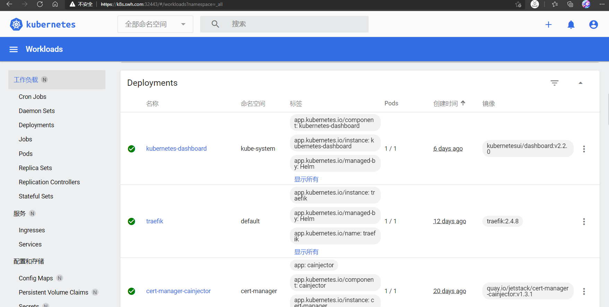

# Dashboard

[dashboard github](https://github.com/kubernetes/dashboard)

## 证书配置
注意: 由于Dashboard只允许本地使用HTTP连接进行访问, 其它地址只允许使用HTTPS访问. 因此这里kubectl proxy暴露外网访问需要 配合HTTPS方式访问. 
而外网访问则涉及到证书等问题.参照官方文档

## 插件安装
- 首先创建secret, **生产环境中应使用[cert-manager](../cert-manager/README.md)创建证书**
    - 创建自签名CA
        ```bash
        # 生成私钥
        openssl genrsa -out ca.key 2048
        # 生成自签名证书
        openssl req -new -x509 -key ca.key -out ca.crt -days 3650 -subj "/C=CN/ST=HB/L=WH/O=DM/OU=YPT/CN=CA"
        ```
    - 根据[dashboard.cnf](dashboard.cnf)创建证书
        ```bash
        # 生成私钥
        openssl genrsa -out dashboard.key 2048
        # 申请签名请求
        openssl req -new -sha256 -key dashboard.key -out dashboard.csr -subj "/C=CN/ST=HB/L=WH/O=DM/OU=YPT/CN=k8s.swh.com"
        # 签发证书
        openssl x509 -req -sha256 -days 3650 -in dashboard.csr -out dashboard.crt -CA ca.crt -CAkey ca.key -CAcreateserial -extfile dashboard.cnf
        ```
    - 创建dashboard secret
        ```bash
        #kubectl create secret generic kubernetes-dashboard --from-file="$YourPath/dashboard.crt,$YourPath/dashboard.key" -n kube-system 
        kubectl create secret generic kubernetes-dashboard --from-file="/root/k8s/dashboard/dashboard.crt,/root/k8s/dashboard/dashboard.key" -n kube-system
        # 查看dashboard secret内容
        kubectl get secret kubernetes-dashboard -o yaml -n kube-system
        ```
    - 在访问所使用的机器上(我的是windows), 添加生成的CA证书, 具体可参考[windows下添加证书](https://jingyan.baidu.com/article/e4511cf35b47fa2b855eaf5d.html)
        - 导入`dashboard.crt`
        
- [helm 安装](https://artifacthub.io/packages/helm/k8s-dashboard/kubernetes-dashboard)
    - 参考[官方 values.yaml](https://github.com/kubernetes/dashboard/blob/master/aio/deploy/helm-chart/kubernetes-dashboard/values.yaml)
    根据自己需求修改后的[values.yaml](values.yaml)
    ```bash
    # Add kubernetes-dashboard repository
    helm repo add kubernetes-dashboard https://kubernetes.github.io/dashboard/
    # Deploy a Helm Release named "my-release" using the kubernetes-dashboard chart
    # helm install -f values.yaml --namespace default kubernetes-dashboard kubernetes-dashboard/kubernetes-dashboard
    helm install kubernetes-dashboard kubernetes-dashboard/kubernetes-dashboard --namespace kube-system -f values.yaml
    ```
    - 卸载
    ```
    # helm uninstall kubernetes-dashboard  --namespace kube-system
    helm delete kubernetes-dashboard --namespace kube-system
    ```
- 使用[values.yaml](values.yaml)里面的`serviceAccount`下的`dashboard-admin`获取访问token 用于访问
[https://k8s.swh.com:32443/](https://k8s.swh.com:32443/) 管理web页面
    ```bash
    # 获取访问用的token令牌
    kubectl describe secret dashboard-admin-token-s54s4 -n kube-system
    ```
    
    
- 由于默认创建的ServiceAccount没有访问权限, 因此我们需要创建`ClusterRoleBinding`资源给予dashboard访问权限
[官方参考](https://github.com/kubernetes/dashboard/blob/master/docs/user/access-control/README.md#admin-privileges),
这里我们使用[dashboard-admin.yaml](dashboard-admin.yaml) 赋予admin权限
    ```bash
    kubectl apply -f dashboard-admin.yaml 
    ```
  
    
    
## 参考
- [官方helm install dashboard](https://github.com/kubernetes/dashboard/tree/master/aio/deploy/helm-chart/kubernetes-dashboard)
- [通过helm安装dashboard详细教程](https://www.cnblogs.com/baoshu/p/13326480.html)