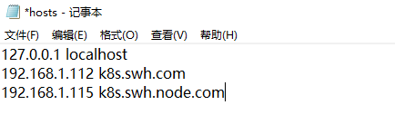
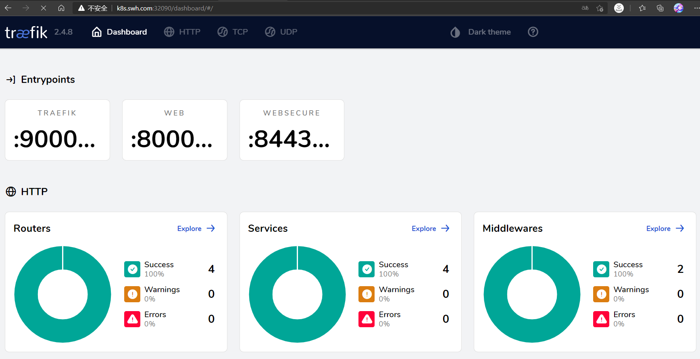
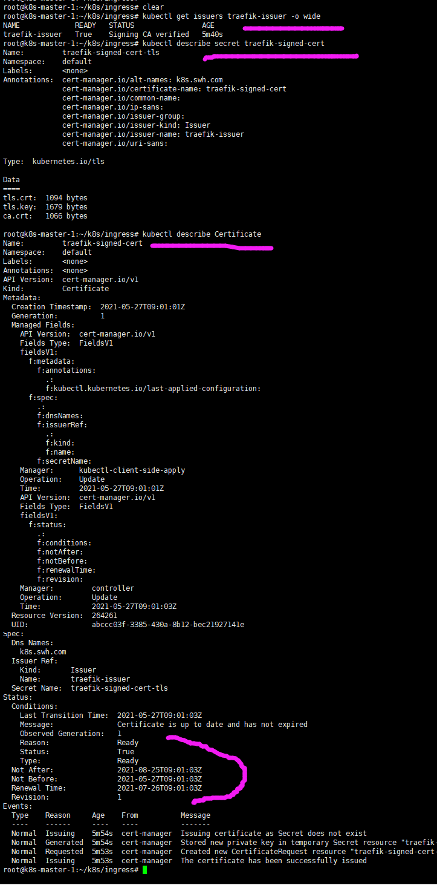

# Ingress

K8s集群内部使用`kube-dns`或`core-dns`实现服务发现的功能, K8s中将集群中的应用暴露给外部用户除了`NodePort`和
`LoadBlancer`的方式之外, K8s提供了`ingress`这个资源对象.

其本质就是从kubernetes集群外部访问集群的一个入口, 将外部的请求转发到集群内不同的Service上, 相当于nginx、haproxy
等负载均衡代理服务器. 只不过不需要像Nginx那样手动更改Nginx配置, 而是由Ingress 通过不断与kube-apiserver打交道, 
实时感知后端service、pod的变化.

## 插件列表
- [traefik](https://traefik.io/)
- [nginx-controller](https://kubernetes.github.io/ingress-nginx/)
- [Kubernetes Ingress Controller for Kong](https://konghq.com/blog/kubernetes-ingress-controller-for-kong/)
- [HAProxy Ingress controller](https://github.com/jcmoraisjr/haproxy-ingress)

目前常用较多的是`traefik`和`nginx-controller`, 前者性能较后者差, 但配置相对会比较简单.


## Traefik介绍

Traefik是一款开源的反向代理与负载均衡工具(Ingress controller). 它最大的优点是能够与常见的微服务系统直接整合, 可以实现自动化动态配置.
. [中文文档](https://www.qikqiak.com/traefik-book/)

### helm 部署
[参考](https://hub.kubeapps.com/charts/traefik/traefik)

#### 部署方法
- 方式1: 不暴露`dashboard`服务部署方式
    ```bash
    helm repo add traefik https://helm.traefik.io/traefik
    helm repo update
    helm install traefik traefik/traefik
    ```
    - 使用命令, 查看pod所在节点
    ```bash
    kubectl describe pod traefik-b5cf49d5b-sq7qb(your pod name)
    ```
    
    - 在该节点上运行命令暴露dashboard 的端口
    ```bash
    kubectl port-forward $(kubectl get pods --selector "app.kubernetes.io/name=traefik" --output=name) 9000:9000
    ```
- 方式2: 根据[values.yaml](values.yaml)自定义部署(打上`-----------`是我修改的地方), 参考[官方 values.yaml](https://github.com/traefik/traefik-helm-chart/blob/master/traefik/values.yaml)
    ```bash
    helm repo add traefik https://helm.traefik.io/traefik
    helm repo update
    helm install traefik traefik/traefik -f values.yaml
    ```
  - 访问: 通过命令`kubectl describe pod traefik`查找部署所在的节点
  
    - 通过`http://192.168.1.117:32090/dashboard/`(values.yaml内使用了nodePort暴露端口)即可访问traefik的dashboard
    
    - 因为`traefik` 默认帮我们创建了`traefik-dashboard` ingressroute
        ```bash
        # 可用命令查看
        kubectl get ingressroute
        ```
      - 因此我们可用域名的方式, 访问在任意节点部署的traefik dashboard服务
        - 使用ingress映射至域名访问, **注意: 因为我是在局域网内的虚拟域名, 因此需要更改windows下`hosts`文件(C:\Windows\System32\drivers\etc)**
            
        - 即可通过`http://k8s.swh.com:32090/dashboard/`进入traefik的dashboard界面
          

#### 设置登录访问
- 首先重新部署traefik, 使用[values-auth.yaml](values-auth.yaml) 关闭ingressRoute, 改为后续的手动配置
```bash
helm uninstall traefik
helm install traefik traefik/traefik -f values-auth.yaml
```
- [参考BasicAuth](https://doc.traefik.io/traefik/middlewares/basicauth/) 中间件
    - 配置Secret: 密码必须是一个 MD5，SHA1 或者 BCrypt 的哈希值
    ```
    apt install -y apache2-utils
    echo $(htpasswd -nb swh 123456) | sed -e s/\\$/\\$\\$/g
    # 得到
    swh:$$apr1$$LhUKazP7$$jAF0zf.bb.hVsz.kgmVPd0
    ```
    - 将其配置至`basic-auth.yaml`中, [basic-auth.yaml](basic-auth.yaml)
    ```bash
    kubectl apply -f basic-auth.yaml
    ```
    至此, 访问即需要验证用户访问了
    

### 关于tls的实践
**`因暂不需要, 未能成功实现`**
- 使用[traefik-dashboard-ingress-route.yaml](traefik-dashboard-ingress-route.yaml)添加ingressroute. 其中含括
    - 创建issuer
    - 获取Certificate证书
    - 创建ingressroute
    ```bash
    kubectl apply -f traefik-dashboard-ingress-route.yaml
    ```
        - 可通过命令查看
          ```bash
          kubectl apply -f traefik-ca-use.yaml
          # 查看traefik-issuer, 如果是clusterissuers资源则是 kubectl get clusterissuers traefik-issuer -o wide
          kubectl get issuers traefik-issuer -o wide
          # 查看生成的证书secret
          kubectl describe secret traefik-signed-cert
          #查看签发的证书(`Certificate`资源)状态
          kubectl describe Certificate
          ```
          


## 参考
- [Helm3部署Traefik 2](https://www.cnblogs.com/hacker-linner/p/13632813.html)
- [traefik 使用](https://www.soulchild.cn/2159.html)