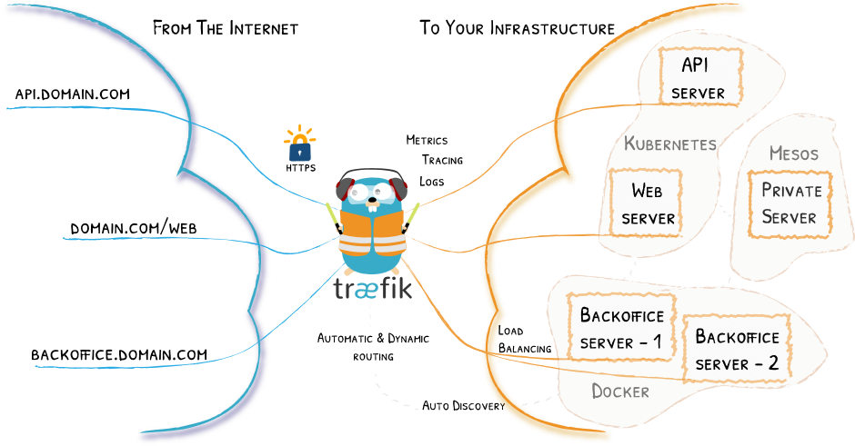
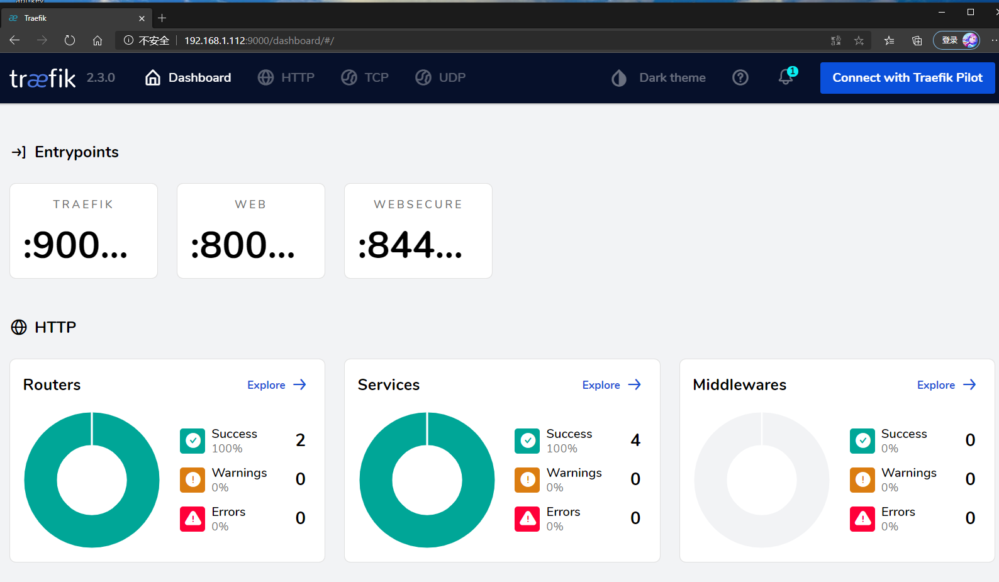

# 外部服务暴露工具: Ingress

K8s集群内部使用`kube-dns`或`core-dns`实现服务发现的功能, K8s中将集群中的应用暴露给外部用户除了`NodePort`和
`LoadBlancer`的方式之外, K8s提供了`ingress`这个资源对象.

其本质就是从kubernetes集群外部访问集群的一个入口, 将外部的请求转发到集群内不同的Service上, 相当于nginx、haproxy
等负载均衡代理服务器. 只不过不需要像Nginx那样手动更改Nginx配置, 而是由Ingress 通过不断与kube-apiserver打交道, 
实时感知后端service、pod的变化.


## 插件列表
要使用ingress, 必须具有[Ingress控制器](https://kubernetes.io/zh/docs/concepts/services-networking/ingress-controllers/)
才能满足Ingress的要求, 这里列举几个简单的:
- [traefik](https://traefik.io/)
- [nginx-controller](https://kubernetes.github.io/ingress-nginx/)
- [Kubernetes Ingress Controller for Kong](https://konghq.com/blog/kubernetes-ingress-controller-for-kong/)
- [HAProxy Ingress controller](https://github.com/jcmoraisjr/haproxy-ingress)

目前常用较多的是`traefik`和`nginx-controller`, 前者性能较后者差, 但配置相对会比较简单.


## Traefik介绍

Traefik是一款开源的反向代理与负载均衡工具. 它最大的优点是能够与常见的微服务系统直接整合, 可以实现自动化动态配置.
. 
[traefik on kubernetes](https://doc.traefik.io/traefik/providers/kubernetes-crd/)
- [k8s官方部署](https://doc.traefik.io/traefik/user-guides/crd-acme/)
- [Helm chart部署(推荐)](https://doc.traefik.io/traefik/getting-started/install-traefik/#use-the-helm-chart)


### 部署
使用helm chart 部署, chart使用的默认[value.yaml](https://github.com/traefik/traefik-helm-chart/blob/master/traefik/values.yaml)
(仅供参考)
```bash
helm repo add traefik https://traefik.github.io/traefik-helm-chart
helm repo update
# 查看包命令: helm show chart traefik/traefik
# 安装traefik, 也可使用各种参数, 如指定命名空间helm install --namespace=traefik-v2 traefik traefik/traefik
helm install traefik traefik/traefik
# helm install traefik traefik/traefik --set dashboard.enabled=true,serviceType=NodePort,rbac.enabled=true
# 可用命令查看部署情况
kubectl get pod -n default
kubectl describe svc traefik --namespace default
```

Exposing the Traefik dashboard
- 用命令(临时)
```bash
kubectl port-forward $(kubectl get pods --selector "app.kubernetes.io/name=traefik" --output=name) 9000:9000 --address=192.168.1.112
# 可使用http://192.168.1.112:9000/dashboard/ 访问
```

- 也可使用自定义配置, [dashboard.yaml](yaml/traefik-dashboard.yaml)

## ingress使用(只做示例未实际使用)
以`traefik`为例(nodePort方式部署), [参考](https://doc.traefik.io/traefik/providers/kubernetes-ingress/)
使用ingress暴露traefik服务[traefik-ingress.yaml](yaml/traefik-ingress.yaml)
- 测试连接, 通过`http://k8s.swh.com:32404`(32404为暴露出来的nodePort接口)来访问traefik的Dashboard服务.
    - 因为`traefik`服务是使用nodePort方式部署在`k8s.swh.node.com`上的, 正常我们只能通过该节点上的
    `Ip` + `port`进行访问, 通过ingress的方式则可以将service暴露在其他节点上.