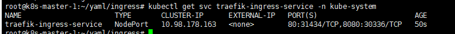

# 外部服务暴露工具: Ingress

K8s集群内部使用`kube-dns`或`core-dns`实现服务发现的功能, K8s中将集群中的应用暴露给外部用户除了`NodePort`和
`LoadBlancer`的方式之外, K8s提供了`ingress`这个资源对象.

其本质就是从kubernetes集群外部访问集群的一个入口, 将外部的请求转发到集群内不同的Service上, 相当于nginx、haproxy
等负载均衡代理服务器. 只不过不需要像Nginx那样手动更改Nginx配置, 而是由Ingress 通过不断与kube-apiserver打交道, 
实时感知后端service、pod的变化.


## 插件列表
- [traefik](https://traefik.io/)
- [nginx-controller](https://kubernetes.github.io/ingress-nginx/)
- [Kubernetes Ingress Controller for Kong](https://konghq.com/blog/kubernetes-ingress-controller-for-kong/)
- [HAProxy Ingress controller](https://github.com/jcmoraisjr/haproxy-ingress)

目前常用较多的是`traefik`和`nginx-controller`, 前者性能较后者差, 但配置相对会比较简单.


## Traefik介绍

Traefik是一款开源的反向代理与负载均衡工具. 它最大的优点是能够与常见的微服务系统直接整合, 可以实现自动化动态配置.
. 
[官方文档](https://docs.traefik.cn/)

### 部署

#### 简单http方式部署
- 使用RBAC安全认证方式[`rbac.yaml`](yaml/rbac.yaml)
```bash
kubectl apply -f rbac.yaml
```
- 部署traefik, 部署文件[`traefik.yaml`](yaml/traefik.yaml)
    ```bash
    kubectl apply -f traefik.yaml
    # 查看部署情况(包括端口)
    kubectl get svc traefik-ingress-service -n kube-system
    ```
    - 现在通过`http://192.168.1.115:30336`(调度部署所在的节点)即可访问到Traefik的Dashboard了.
    


#### 支持https部署


### [安全认证部署](#Ingress tls和path)