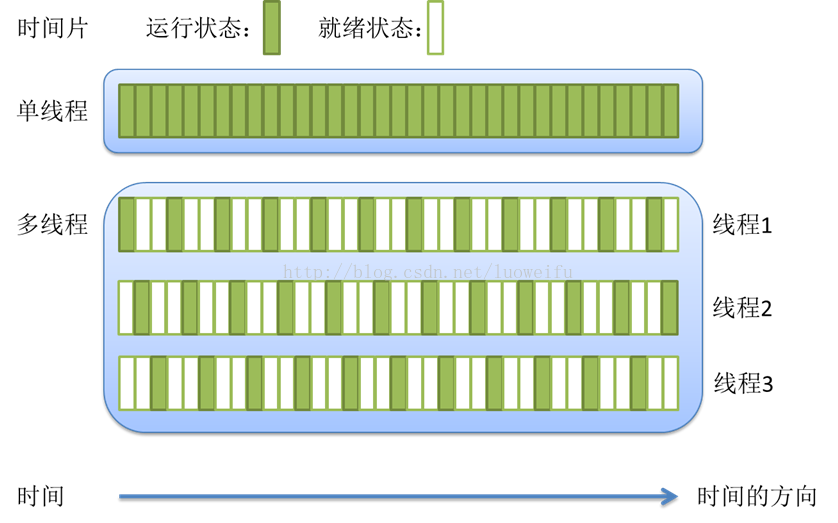
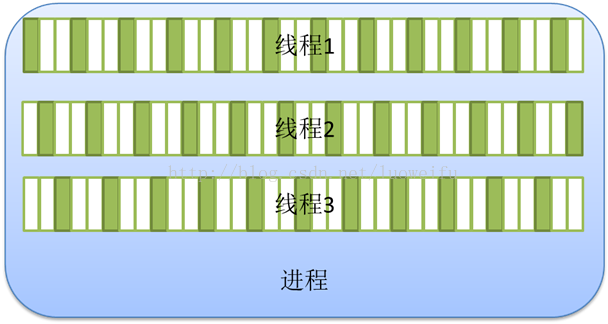

# 并发

Go使用CSP(communicating sequential processes)并发模型

##
  进程是一个具有一定独立功能的程序在一个数据集上从一次动态执行的过程, 是操作系统进行资源分配和调度的一个独立
单位, 是应用程序运行的载体. 一般由以下三个部分组成
- 程序: 描述进程要完成的功能, 是控制进程执行的指令集
- 数据集: 程序执行时所需要的的数据和工作区
- 控制块: 包含进程的描述信息和控制信息, 是进程存在的唯一标志

** 进程是操作系统分配资源的最小单位 **
** 进程间相互独立 **
** 一个进程可以有一个或多个线程 **

## 线程
  线程是操作系统能够进行运算调度的最小单位. 它被包含在进程之中, 是进程中的实际运作单位. 它是程序执行中
一个单一的顺序控制流程, 是程序执行流的最小单位, 是处理器调度和分派的基本单位. 

一个标准的线程组成:
- 线程ID
- 当前指令指针PC
- 寄存器
- 堆栈

** 各个线程之间共享程序的内存空间(也就是所在进程的空间) **
  

*********单个或多个线程切换运行:*********

*********进程与线程的关系:*********

*********多线程运行:*********

## Goroutine(协程)
Goroutine是建立在线程之上的轻量级的抽象. 以非常低的代价在同一个地址空间中并行地执行多个函数或者方法. 
相比于线程, 它创建和销毁的代价要小很多, 并且它的调度是独立于线程的.

** 协程不由操作系统内核所管理, 完全由程序控控制 **

- [goroutine基础用法](baseGoroutine.go)
- [goroutine with channel](channel.go)
- [goroutine with context](context.go)

## context

  每个进程和线程都有自身运行的上下文数据, 以便和其他进程和线程区分. Context指做一件事情的背景/环境/上下文/所需要的
必要数据. 示例:
- AppContext应用上下文, 包含整个App运行期间必要的数据
- UserContext用户上下文, 包含一个User的上下文数据

[DDD中的限界上下文](https://www.cnblogs.com/daoqidelv/p/7518533.html)

[base example](../../chapter1/context.go)
[context use example](context.go)