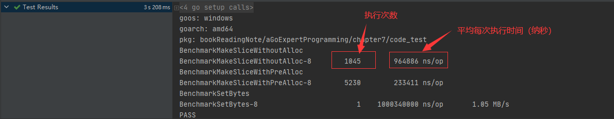
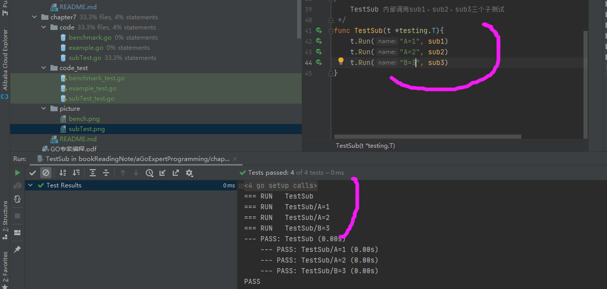

# go test

go test 支持的测试类型有:
* 单元测试
* 性能测试
* 示例测试


## 基础测试

### 单元测试
单元测试是指对软件中的最小可测试单元进行检查和验证，比如对一个函数的测试

规则:
* 测试文件以`_test.go`为结尾
* 测试函数名以`TestXxx`开始

测试文件存放的两种方式: 
* 测试文件和源文件在同一个包内: [示例](../chapter2/code/select_test.go)
* 创建一个包专用于测试, 这样可以使测试文件和源文件隔离(`常用`): [示例](../chapter5/code_test)
    - 命名规则: `包名` + `_test`

命令:
```bash
// 只会执行以Test开头的单元测试代码
go test
```

工具: `testing.T`

### 性能测试
性能测试，也称基准测试，可以测试一段程序的性能，可以得到时间消耗、内存使用情况的报告

规则: 
* 文件名必须以“_test.go”结尾
* 测试函数名以`BenchmarkXxx`开始

命令:
```bash
go test -bench=.
```

工具: `testing.B`


[示例](code_test/benchmark_test.go)



### 示例测试
示例测试，广泛应用于Go源码和各种开源框架中，用于展示某个包或某个方法的用法

```go
type	InternalExample	struct	{
	Name				string			//	测试名称
	F					func()			//	测试函数
	Output				string			//	期望字符串
	Unordered	bool						//	输出是否是无序的
}
```

规则:
* 测试函数命名`Examplexxx`
* 检测单行输出格式为`// Output: <期望字符串>`
* 检测多行输出格式为`// Output: \ <期望字符串> \ <期望字符串>`，每个期望字符串占一行
* 检测无序输出格式为`// Unordered output: \ <期望字符串> \ <期望字符串>`，每个期望字符串占一行
* 注意: 
    - 测试字符串时会自动忽略字符串前后的空白字符
    - 如果测试函数中没有“Output”标识，则该测试函数不会被执行

[示例](code_test/example_test.go)


## 进阶测试

### 子测试
子测试提供一种在一个测试函数中执行多个测试的能力. 比如多个测试函数需要执行相同的初始化工作

规则:
* 命名规则: `<父测试名字>/<传递给Run的名字>`

* 使用命令` go test -run Sub/A=`只会过滤测试`A=*`的子测试.
    - 同理`-bench`用于性能测试
    
#### 并发子测试
使用`t.Parallel()`将当前测试加入到并发队列中

总结:
* 子测试适用于单元测试和性能测试
* 子测试可以控制并发
* 子测试提供一种类似table-driven风格的测试
* 子测试可以共享setup和tear-down


### Main测试
单元测试、性能测试和示例测试在经过编译后都会被存放到一个testing.M数据结构中

如果声明了Main测试, 当前测试程序将不是直接执行各项测试，而是将测试交给TestMain调度
[示例](code_test/mainTest_test.go)

TestMain()函数通常会有一个m.Run()方法，该方法会执行单元测试、性能测试和示例测试，
如果用户实现了TestMain()但没有调用m.Run()的话，那么什么测试都不会被执行


## 打桩测试
[mock打桩测试](../../project/mock/README.md)


