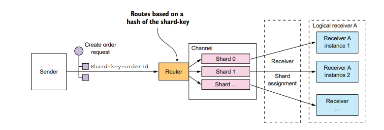

# 基于异步消息模式的通信

服务之间的通信采用异步交换消息的方式完成. 例如: 某种消息传递模型, 消息通过消息通道进行交换. 发送方
将消息写入通道, 接收方从通道读取消息.

## 消息传递

### 消息

消息: 由消息头部和消息主体组成. 消息正文是以文本或二进制格式发送的数据, 有以下几种不同类型的消息
- 文档: 仅包含数据的通用消息.
- 命令: 一条等同于RPC请求的消息. 指定要调用的操作及参数.
- 事件: 表示发送方这一端发生了重要的事件. 事件通常是领域事件, 表示领域对象的状态更改.

### 消息通道

消息通道是消息传递基础设施的抽象. 有两种类型
- 点对点通道
- 发布-订阅通道

## 消息机制的服务API规范

服务的异步API由消息通道、命令、回复和事件消息类型组成
- 请求/异步响应式API: 包括服务的命令消息通道、服务接受的命令式消息的具体类型和格式, 以及服务发送的
回复消息的类型和格式.
- 单向通知式API: 包括服务的命令消息通道, 以及服务接受的命令式消息的具体类型和格式.

## 消息代理

基于消息传递的应用程序通常使用消息代理, 即服务通信的基础设施服务. 

- 无代理消息: 服务直接交换消息. 代表[ZeroMQ](https://zeromq.org/), [文档](https://zeromq.org/get-started/)
- 基于代理的消息: 消息代理是所有消息的中介节点. 发送方将消息写入消息代理, 消息代理将消息发送给接收方.
    - [Kafka](http://kafka.apache.org/), [本人Kafka with python](https://github.com/shanwenhao1/Kafka)
    - [RabbitMQ](https://www.rabbitmq.com/)
    - [Apache ActiveMQ](http://activemq.apache.org/)
    - [EMQ(mqtt)](https://www.emqx.io/cn/): 物联网相关, [本人示例部署](https://github.com/shanwenhao1/EMQ)
    
## 处理并发和消息顺序

横向扩展使用多个线程和服务实例处理并发消息. 伴随的问题是消息的处理如何确保每个消息只被处理一次且是按照正确顺序进行处理.
解决方案: 分片(分区通道)

----
该事件中, 每个Order事件都将orderId作为其分片键. 特定订单的每个事件都发布到同一个分片, 而且该分片中的消息始终由同一个接收方
实例读取, 从而确保顺序处理这些消息.
----
处理重复消息的两种方法
- 编写幂等消息处理程序(幂等性: 应用被相同参数多次重复调用时, 不会产生而外的效果): 保持消息传递的顺序正确性就行
- 跟踪消息并丢弃重复项: 记录已处理消息的message id, 再次传入带此message id的消息时, 丢弃该消息.

## 事务性消息
- [Debezium](https://debezium.io/): 可以向Apache Kafka消息代理发布数据库更改
- [作者的开源事务消息库](https://github.com/eventuate-tram/eventuate-tram-core)
    - 事务性消息机制: 它将消息作为数据库事务的一部分发布
    - 重复消息检测机制: 支持消息的接收方检测并丢弃重复消息.