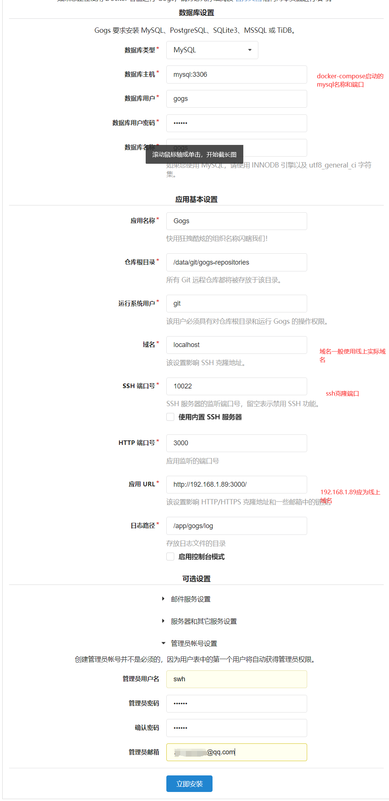
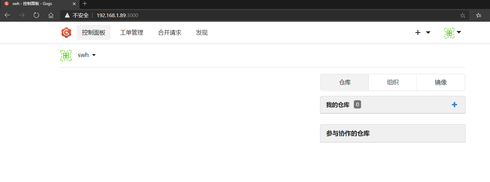
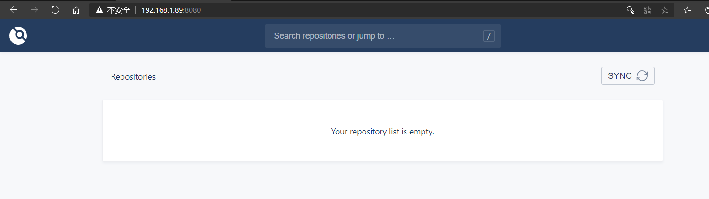

# Git服务搭建及使用

基于[Gogs](https://github.com/gogs/gogs/blob/main/README_ZH.md) + 
[Drone](https://docs.drone.io/) 构建私有CI/CD平台
- drone是一个持续交付平台、内建一个强大的`pipeline`引擎, 我们可以用其来自定义`workflow`(包含build、test、发布等流程)
- [参考](https://docs.drone.io/server/provider/gogs/) install drone for Gogs

## 准备

linux系统、[docker](../../../Kubernetes/prepare/docker.md)、
[docker-compose](../../../Kubernetes/prepare/docker.md#Docker Compose)容器编排
- 确保docker-compose安装完成


## 安装

两种安装方式: 
- [docker直接安装](#docker)
- [docker-compose一键安装](#docker-compose)

### docker容器分开安装
**注意: docker版本需要`1.40`及以上**

- 安装gogs, 根据[gogs.yml](yml/gogs.yml)
    ```bash
        docker-compose -f gogs.yml up -d
    ```
- 安装drone
    - 安装[drone server](https://docs.drone.io/server/provider/gogs/)
    ```bash
        docker run \
          --volume=/var/lib/drone:/data \
          --env=DRONE_AGENTS_ENABLED=true \
          --env=DRONE_GOGS_SERVER=http://192.168.1.89:3000 \
          --env=DRONE_RPC_SECRET=ALQU2M0KdptXUdTPKcEw \
          --env=DRONE_SERVER_HOST=192.168.1.89:8080 \
          --env=DRONE_SERVER_PROTO=http \
          --publish=8080:80 \
          --publish=8843:443 \
          --restart=always \
          --detach=true \
          --name=drone-server \
          drone/drone:latest  
    ```
    - 安装[drone runner](https://docs.drone.io/runner/overview/)
    ```bash
        docker pull drone/drone-runner-docker:latest
        docker run -d \
          -v /var/run/docker.sock:/var/run/docker.sock \
          -e DRONE_RPC_PROTO=http \
          -e DRONE_RPC_HOST=192.168.1.89:8080 \
          -e DRONE_RPC_SECRET=ALQU2M0KdptXUdTPKcEw \
          -e DRONE_RUNNER_CAPACITY=2 \
          -e DRONE_RUNNER_NAME=${HOSTNAME} \
          -p 7300:3000 \
          --restart always \
          --name drone-runner \
          drone/drone-runner-docker:latest
    ```

### docker-compose一键安装
- 使用docker-compose按照[docker-compose.yml](yml/docker-compose.yml)配置文件安装gogs+drone组成CI/CD平台
    ```bash
    docker-compose up -d
    ```
    - (可选)也可选择分开gogs、drone安装, 方便管理
        ```
        docker-compose -f gogs.yml up -d
        docker-compose -f drone.yml up -d
            docker-compose -f gogs.yml stop
            docker-compose -f gogs.yml rm
        ```
- 使用`http://192.168.1.89:3000/`进入gogs并初始化它(192.168.1.89为部署机器的内网ip), 其中
    - 数据库设置: 按照[docker-compose](yml/docker-compose.yml)中启动的数据库(数据库主机: `mysql:3306` 用户: `gogs`, 密码: `pass`)
    - 应用基本设置: 
        - 替换域名为实际域名
        - 更改SSH端口号为我们配置的 `10022`端口
        - 应用URL配置为`http://域名:3000/`形式
    - 此外还可以设置邮件服务设置、服务器和其它服务设置(包括禁止用户自主注册、启用验证码服务等)
    - 创建管理员账号
        - 用户名: swh
        - 密码: 123456
        - 邮箱: *****@qq.com
        
    示例: 
    创建完成后gogs界面 
- drone: 使用`http://192.168.1.89:8080/` 访问drone, 账号和密码是我们设置的gogs管理员账号
    drone 界面 

## [使用](use-example.md)

## 参考
[使用drone和gogs搭建自己的CI/CD系统](https://www.jianshu.com/p/fe2521afddcf?utm_campaign=maleskine&utm_content=note&utm_medium=seo_notes&utm_source=recommendation)
[基于 Gogs + Drone 构建私有 CI/CD 平台 | Docker 篇](https://zhuanlan.zhihu.com/p/53109424)