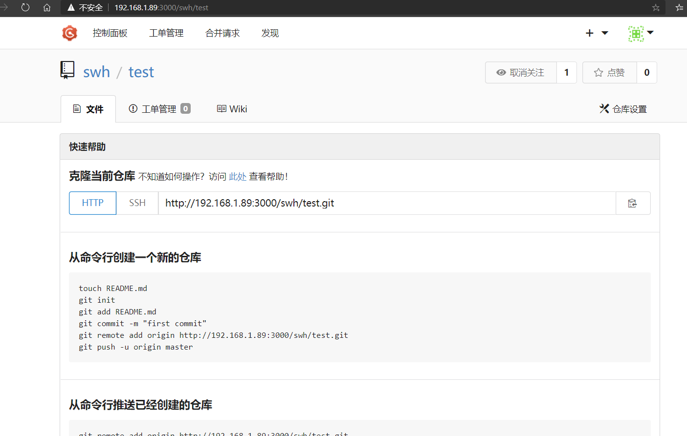
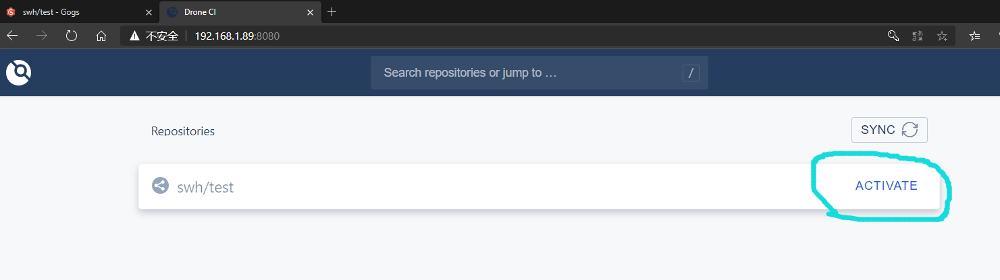
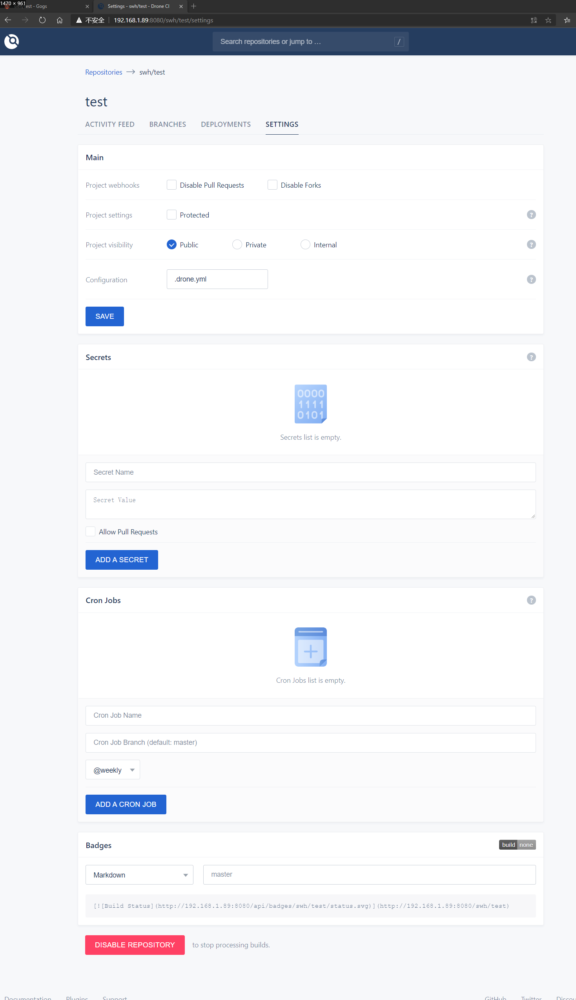
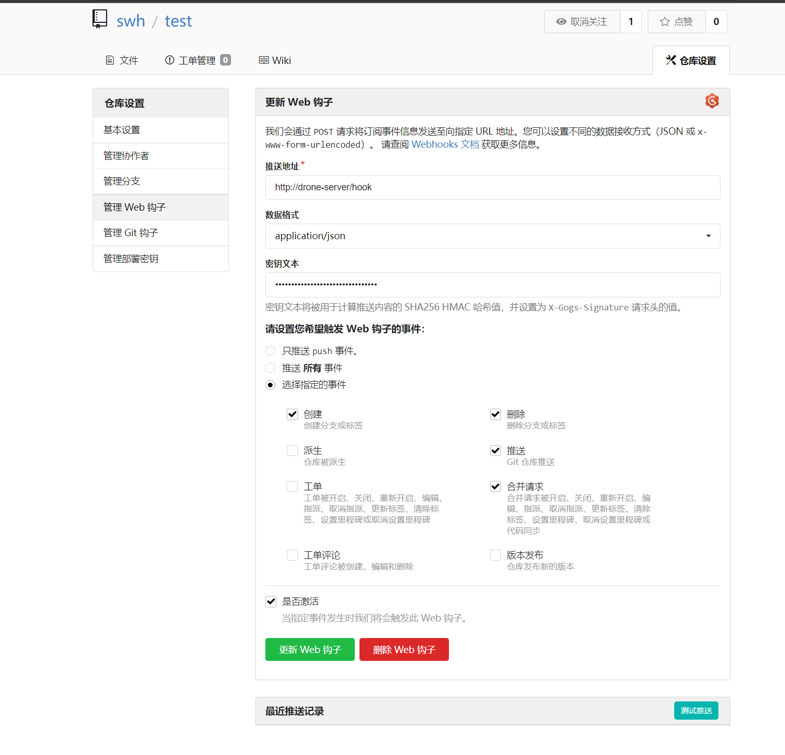
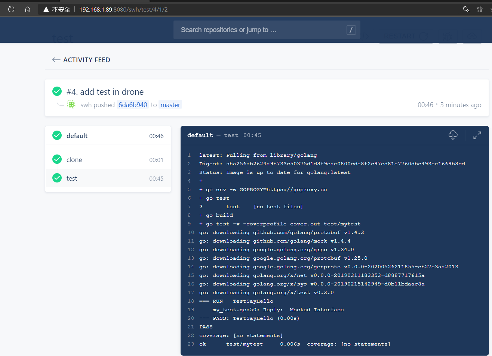

# Gogs+drone使用示例

- 在Gogs中新建一个项目仓库
    
- 登录drone中, 激活该项目
    
    - 可以按照个人需要进行一些设置
        
- 返回Gogs中可见dron webhook已经配置好了
    
    
## drone.yml配置
请参考[drone官方example](https://docs.drone.io/pipeline/docker/examples/) 在项目下创建
`.drone.yml`文件. 这里以[Go 为例](.drone.yml)

构建完`.drone.yml`文件后, 每次更改提交后可登录drone控制台查看项目构建进度

效果如下:

## 可参考
- [Drone服务初使用](https://developer.aliyun.com/article/744529)