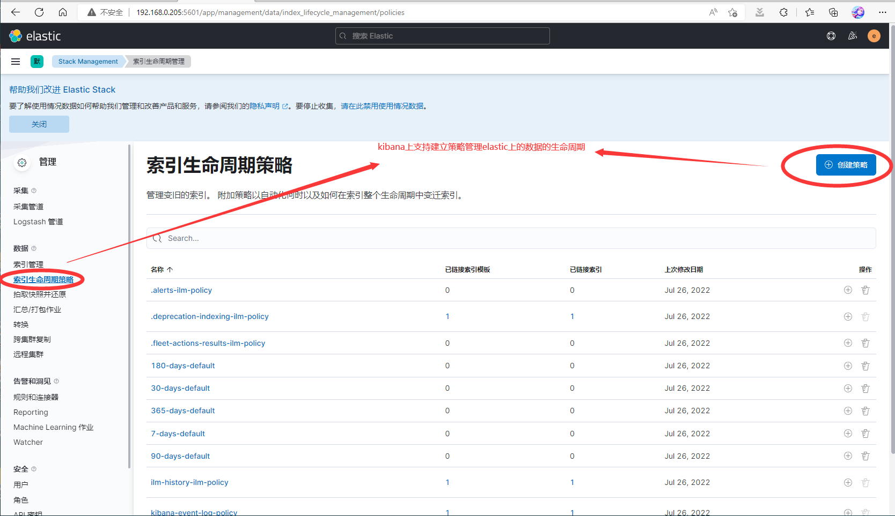
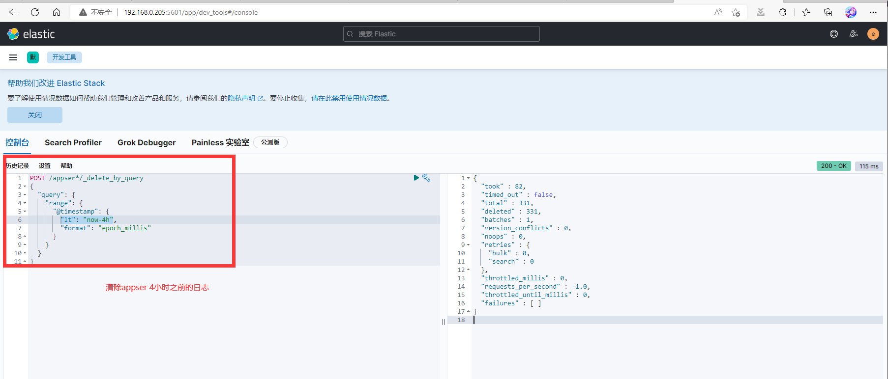

# elasticsearch 数据定时清理
[清理步骤](#清理步骤)
- [使用索引策略清理](#使用索引策略清理)
- [脚本定时清理](#脚本定时清理)
- [使用kibana控制台清理](#使用kibana控制台清理)


目前elasticsearch主要存放日志文件, 因此为了避免磁盘占用
定时清理过期数据是很有必要的

## 清理步骤

已知有三种清理方法, 方法如下

### 使用索引策略清理
[官方文档](https://www.elastic.co/guide/en/elasticsearch/reference/7.17/index-lifecycle-management.html)


### 脚本定时清理
脚本清理有两种方案:
- 所有数据清理: [es-clean.sh](es-clean.sh), [参考](https://blog.csdn.net/huchao_lingo/article/details/103859938)
- 指定索引数据清理: [es-clean2.sh](es-clean2.sh)

使用linux的crontab 定时任务执行脚本(这里就不列出来)

### 使用kibana控制台清理
使用控制台命令, [参考](https://blog.csdn.net/geekswg/article/details/107097322)
- 所有索引数据清理:
```bash
POST /*/_delete_by_query
{
  "query": {
    "range": {
      "@timestamp": {
        "lt": "now-30d",
        "format": "epoch_millis"
      }
    }
  }
}
```
- 指定索引数据清理:

```bash
# 以appser*为例, 索引
POST /appser*/_delete_by_query
{
  "query": {
    "range": {
      "@timestamp": {
        "lt": "now-30d",
        "format": "epoch_millis"
      }
    }
  }
}


curl -XDELETE "http://localhost:9200/*-(date -d "-30 day" +"%Y.%m.%d")?pretty"
```
- `"lt": "now-30d"`: 指的是删除30天前的数据
  - `"lt": "now-4h"`: 指的删除4小时之前的数据(已测过)