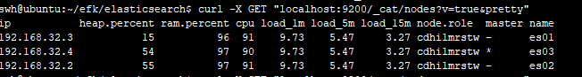

# Elasticsearch 安装及使用

elasticsearch部署至少需要三个节点(一个主节点 + 两个数据节点) 构成集群.

[elasticsearch各语言客户端](https://www.elastic.co/guide/en/elasticsearch/client/index.html)


## docker方式安装
[官方指导](https://www.elastic.co/guide/en/elasticsearch/reference/7.10/docker.html)
- 下载
```bash
# elasticsearch只支持固定版本号, 不支持latest, 可用docker search elasticsearch 最新的版本号
docker pull elasticsearch:7.10.1
```
- 启动单节点
```bash
# 只用作演示, 生产环境中不建议(未持久化volume)
docker run -d -p 9200:9200 -p 9300:9300 --name elasticsearch -e "discovery.type=single-node" elasticsearch:7.10.1
```

## docker-compose方式安装

根据[docker-compose.yml](yml/elasticsearch/docker-compose.yml)部署elasticsearch
集群(该配置只是在单机进行模拟, 生产环境中不同的node需要部署在不同的机器上)
- 给目录赋予权限
```bash
chmod -R 777 elasticsearch
```
- 将`docker-compose.yml`文件放入`elasticsearch`目录中并执行启动命令
```bash
# es01监听在9200端口, es02、es03在docker network上, 生产环境部署时要注意
docker-compose up -d
# 使用命令检查集群是否正常启动
curl -X GET "localhost:9200/_cat/nodes?v=true&pretty"
```

部署结果
, [详情](https://www.elastic.co/guide/en/elasticsearch/reference/7.10/docker.html#_set_vm_max_map_count_to_at_least_262144)


## 注意事项
- 设置`vm.max_map_count`至少`262144`
```bash
# 一般系统已经设置了vm.max_map_count=262144, 可用cat /ect/sysctl.conf 查看
sysctl -w vm.max_map_count=262144
```

## 参考
- [Elasticsearch社区中文文档](https://learnku.com/docs/elasticsearch73/7.3)