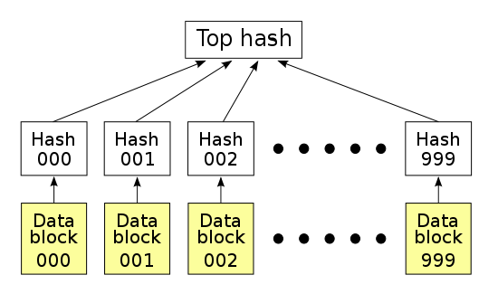

# 数据传输方案

## 点对点网络传输(p2p)
`Hash的概念`: Hash是一个把任意长度的数据映射成固定长度数据的函数. 例如, 对于数据完整性校验, 
最简单的方法是对整个数据做Hash运算得到固定长度的Hash值,然后把得到的Hash值公布在网上,这样用户下载到数据之后,
对数据再次进行Hash运算,比较运算结果和网上公布的Hash值进行比较,如果两个Hash值相等,说明下载的数据没有损坏.

### HashList
在点对点网络数据传输时, 会同时从多个机器上下载数据, 但是很多机器可以认为是不稳定或者不可信的. 为了校验数据的完整性, 通常是把大的
文件分割成小的数据块(例如分割成2k单位的数据块). 这时候需要为每个数据块做Hash以确保数据块是正确的. 
BT下载的时候,在下载到真正数据之前,我们会先下载一个Hash列表. 为了确保这个Hash列表是正确的, 这个Hash列表本身需要做一次Hash运算(以得到Hash
列表的根Hash, 用于校验Hash列表是否正确)

###  Merkle Tree
[go merkle-Tree example](goMerkletree/README.md)
在最底层, 和哈希列表一样, 我们把数据分成小的数据块(每个数据块都有相应的哈希对应), 但是往上走,并不是直接去运算根哈希,
而是把相邻的两个哈希合并成一个字符串,然后运算这个字符串的哈希,这样每两个哈希就结婚生子,得到了一个”子哈希“.
如果最底层的哈希总数是单数,那到最后必然出现一个单身哈希,这种情况就直接对它进行哈希运算,所以也能得到它的子哈希.
于是往上推,依然是一样的方式,可以得到数目更少的新一级哈希,最终必然形成一棵倒挂的树,到了树根的这个位置,这一代就剩下一个根哈希了,
我们把它叫做 Merkle Root.

Hash List与Merkel Tree的区别:
- 可以直接下载并立即验证Merkle Tree的一个分支.因为可以将文件切分成小的数据块,这样如果有一块数据损坏,仅仅重新下载这个数据块就行了.
而Hash list只有下载整个hash list才能验证.
- Merkle Tree可以看做Hash List的泛化.
- Merkle Tree是一种树(大多数是二叉树)

## 参考
- [Merkle Tree](https://www.cnblogs.com/fengzhiwu/p/5524324.html)